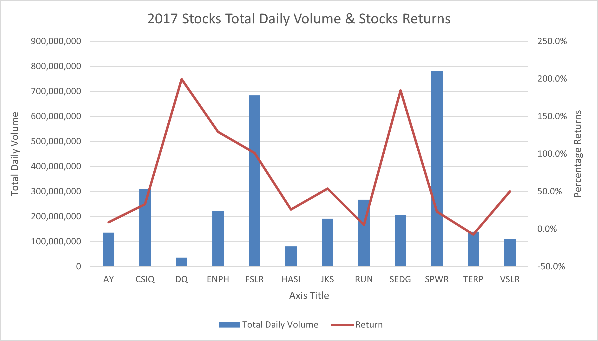
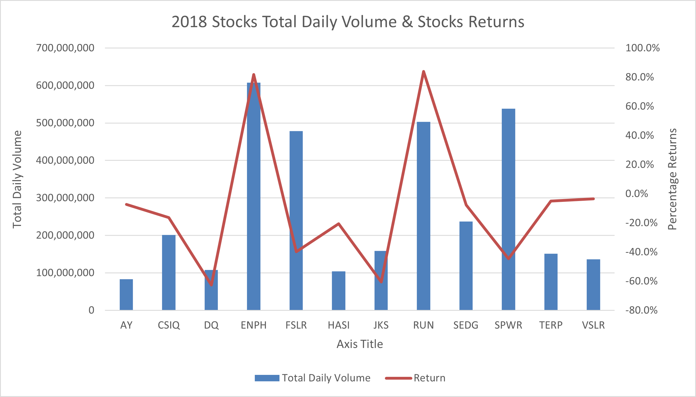
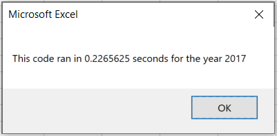
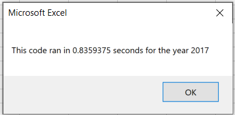
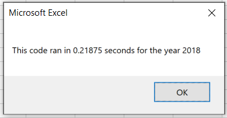
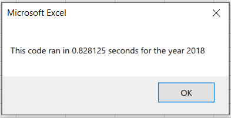

# Green Stock Analysis

## Project Overview

The aim of this project is to find out stocks that are profitable for Steve to invest in. He wants an analysis that can run fast with thousand of stocks instead of the dozen stocks.

The analysis is also to refactor the code and make it run faster when a lot of stocks are analyzed or when there is a whole lot of data.

## Results

### Stock Analysis

From the image below, all stocks except **TERP** had a returns percentage above 0% in the year 2017. **DQ** and **SEDG** were the best performing stocks that year.

In 2018, **ENPH** and **RUN** were the only profitable stocks for that year according to the image below.

Based on the information form the charts, I will recommend that investments be made in **ENPH** and **RUN**. **ENPH** grew by 129% while **RUN** by 5.5% at the end of 2017 and at the end of 2018 **ENPH** grew by 81.9% while **RUN** by 84.0%

Looking at the charts, you will also observe that the total daily volumes traded for both stocks increased exponentially. **ENPH** volumes increased by 173% while that of **RUN** increased by 87%, showing that there is a lot of interest in both stocks.

### Runtime Analysis

From refactoring the code, the runtime of the program reduced significantly. The runtime is as follows:

<<<<<<< HEAD
* The runtime of the refactored code took approximately 0.23 second for 2017 worksheet while it was 0.84 second for the normal code, the images below shows the different runtime.

					Refactored Code Runtime
					
					

					Normal Code Runtime 
								
* The runtime of the refactored code took approximately 0.22 second for 2018 worksheet while it was 0.83 second for the normal code, the images below shows the different runtime.

=======
* It took approximately 0.38 second for the runtime of the 2017 worksheet and the image below shows the runtime.

* It took approximately 0.36 second for the runtime of the 2018 worksheet and the image below shows the runtime.

>>>>>>> e8e73219bd841c8b708dee60aad3a61c65b43160

					Refactored Code Runtime

					Normal Code Runtime

## Summary

My recommendation to Steve will to invest in **ENPH** and **RUN** due to their increase in trading volumes and percentage returns.

Refactoring has some very good benefits and can also have some demerits and some of them are below.
### Merits of Refactoring Code
* It helps make the runtime of codes faster 
* It Makes code cleaner and more organized
* It helps in code maintenance
* You can find bugs when you refactor

### Demerits of Refactoring Code
* It is easy to make mistakes when it is a large application
* There is a risk of not understanding what the code is all about due to less or incoherent comments.

From the refactoring of the code, the use of arrays for the storing the outputs significantly reduced the code runtime. Also because the code was not large and it was well commented on, refactoring the code did was not tedious.
